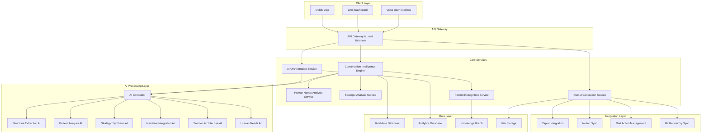

# Design Document

## Overview

The Intelligence OS Meeting Intelligence Platform is designed as a sophisticated, enterprise-grade system that implements the Oracle 9.1 Protocol through a microservices architecture with advanced AI orchestration capabilities. The platform combines voice-first interaction paradigms with comprehensive analytical processing to transform meetings into actionable organizational intelligence.

The design emphasizes real-time responsiveness for user interactions while supporting deep, asynchronous analysis that generates protocol-compliant outputs. The system architecture enables seamless scaling from small teams to enterprise organizations while maintaining consistent performance and analytical depth.

## Architecture

### High-Level System Architecture



### Microservices Architecture

The platform implements a microservices architecture with eight core services:

**1. Conversation Intelligence Engine**
- Real-time voice processing and speech recognition
- Natural language understanding and intent recognition
- Speaker identification and conversation flow management
- Real-time response generation and user interaction

**2. AI Orchestration Service**
- Coordinates multiple specialized AI engines
- Manages resource allocation and processing priorities
- Implements conductor-performer model for AI collaboration
- Handles conflict resolution and result synthesis

**3. Human Needs Analysis Service**
- Analyzes six fundamental human needs patterns
- Identifies need fulfillment and imbalance indicators
- Generates targeted intervention recommendations
- Maintains privacy-preserving analytics capabilities

**4. Strategic Analysis Service**
- Evaluates alignment with strategic frameworks (SDGs, Doughnut Economy, Agreement Economy)
- Generates strategic recommendations and impact assessments
- Performs multi-framework analysis and optimization
- Creates exponential thinking assessments

**5. Pattern Recognition Service**
- Identifies recurring themes and behavioral patterns
- Tracks organizational trends and systemic issues
- Generates intervention protocols and best practices
- Maintains longitudinal pattern analysis

**6. Output Generation Service**
- Creates all twelve Oracle 9.1 Protocol output sections
- Manages file formatting and metadata requirements
- Handles external system synchronization
- Maintains version control and audit trails

**7. Integration Hub Service**
- Manages all external system integrations
- Handles webhook processing and data synchronization
- Implements conflict resolution for concurrent updates
- Provides comprehensive monitoring and alerting

**8. Security and Privacy Service**
- Implements end-to-end encryption and access controls
- Manages user authentication and authorization
- Provides comprehensive audit logging
- Ensures regulatory compliance and data protection

## Components and Interfaces

### Voice-First Interface Components

**Speech Recognition Module**
```typescript
interface SpeechRecognitionConfig {
  language: string;
  continuous: boolean;
  interimResults: boolean;
  maxAlternatives: number;
  noiseReduction: boolean;
}

interface SpeechResult {
  transcript: string;
  confidence: number;
  speaker: string;
  timestamp: Date;
  alternatives: string[];
}
```

**Voice Command Processor**
```typescript
interface VoiceCommand {
  intent: string;
  entities: Record<string, any>;
  confidence: number;
  context: ConversationContext;
}

interface VoiceResponse {
  text: string;
  audio?: ArrayBuffer;
  actions: Action[];
  visualElements?: UIElement[];
}
```

### AI Orchestration Components

**AI Conductor Interface**
```typescript
interface AIConductor {
  coordinateAnalysis(input: MeetingInput): Promise<AnalysisResult>;
  managePerformers(performers: AIPerformer[]): void;
  resolveConflicts(conflicts: AnalysisConflict[]): Resolution[];
  synthesizeResults(results: PerformerResult[]): ComprehensiveAnalysis;
}

interface AIPerformer {
  id: string;
  specialty: AnalysisDimension;
  analyze(input: AnalysisInput): Promise<PerformerResult>;
  communicate(message: InterAIMessage): Promise<InterAIResponse>;
}
```

**Analysis Processing Pipeline**
```typescript
interface AnalysisInput {
  transcript: string;
  participants: Participant[];
  context: MeetingContext;
  metadata: MeetingMetadata;
}

interface AnalysisResult {
  dimensions: SixDimensionalAnalysis;
  outputs: ProtocolOutputs;
  insights: Insight[];
  recommendations: Recommendation[];
}
```

### Human Needs Analysis Components

**Needs Assessment Engine**
```typescript
interface HumanNeedsAnalysis {
  certainty: NeedAssessment;
  variety: NeedAssessment;
  significance: NeedAssessment;
  connection: NeedAssessment;
  growth: NeedAssessment;
  contribution: NeedAssessment;
}

interface NeedAssessment {
  fulfillmentLevel: number; // 0-10 scale
  indicators: string[];
  imbalances: Imbalance[];
  interventions: Intervention[];
}

interface Intervention {
  type: InterventionType;
  description: string;
  implementation: string[];
  expectedOutcome: string;
  timeline: string;
}
```

### Strategic Framework Integration

**Multi-Framework Analysis**
```typescript
interface StrategyFramework {
  name: string;
  version: string;
  assessmentCriteria: Criterion[];
  scoringMethod: ScoringMethod;
}

interface FrameworkAlignment {
  framework: StrategyFramework;
  score: number;
  alignedElements: string[];
  gaps: Gap[];
  recommendations: StrategyRecommendation[];
}

interface StrategyRecommendation {
  priority: Priority;
  description: string;
  implementation: ImplementationPlan;
  impact: ImpactAssessment;
}
```

### External Integration Interfaces

**Zapier Integration**
```typescript
interface ZapierWebhook {
  trigger: string;
  payload: MeetingTranscript;
  metadata: WebhookMetadata;
}

interface MeetingTranscript {
  title: string;
  date: Date;
  participants: string[];
  content: string;
  format: 'markdown' | 'text' | 'json';
}
```

**Notion Database Sync**
```typescript
interface NotionDatabase {
  id: string;
  name: string;
  schema: DatabaseSchema;
  syncConfig: SyncConfiguration;
}

interface SyncConfiguration {
  bidirectional: boolean;
  conflictResolution: ConflictResolutionStrategy;
  updateFrequency: number;
  fieldMappings: FieldMapping[];
}
```

## Data Models

### Core Meeting Data Model

```typescript
interface Meeting {
  id: string;
  title: string;
  date: Date;
  duration: number;
  participants: Participant[];
  transcript: ConversationTranscript;
  analysis: SixDimensionalAnalysis;
  outputs: ProtocolOutputs;
  metadata: MeetingMetadata;
}

interface ConversationTranscript {
  segments: TranscriptSegment[];
  speakers: SpeakerMap;
  timeline: TimelineEvent[];
  topics: Topic[];
}

interface TranscriptSegment {
  id: string;
  speaker: string;
  text: string;
  timestamp: Date;
  confidence: number;
  emotions: EmotionAnalysis;
  intent: IntentAnalysis;
}
```

### Oracle 9.1 Protocol Data Models

```typescript
interface SixDimensionalAnalysis {
  structuralExtraction: StructuralAnalysis;
  patternSubtext: PatternAnalysis;
  strategicSynthesis: StrategyAnalysis;
  narrativeIntegration: NarrativeAnalysis;
  solutionArchitecture: SolutionAnalysis;
  humanNeedsDynamics: HumanNeedsAnalysis;
}

interface ProtocolOutputs {
  executiveSummary: ExecutiveSummary;
  decisionsAgreements: DecisionLog;
  actionRegister: ActionRegistry;
  strategicImplications: StrategyImplications;
  discussionDynamics: DiscussionAnalysis;
  humanNeedsEmotionalIntelligence: HumanNeedsReport;
  patternRecognition: PatternReport;
  integrityAlignment: AlignmentCheck;
  narrativeDevelopment: NarrativeReport;
  communicationHighlights: CommunicationReport;
  solutionPortfolio: SolutionPortfolio;
  humanNeedsFulfillmentPlan: FulfillmentPlan;
}
```

### Knowledge Graph Data Model

```typescript
interface KnowledgeNode {
  id: string;
  type: NodeType;
  properties: Record<string, any>;
  relationships: Relationship[];
  metadata: NodeMetadata;
}

interface Relationship {
  id: string;
  type: RelationshipType;
  source: string;
  target: string;
  weight: number;
  properties: Record<string, any>;
}

interface KnowledgeGraph {
  nodes: KnowledgeNode[];
  relationships: Relationship[];
  schema: GraphSchema;
  analytics: GraphAnalytics;
}
```

## Error Handling

### Comprehensive Error Management Strategy

**Error Classification System**
```typescript
enum ErrorType {
  VOICE_PROCESSING_ERROR = 'voice_processing_error',
  AI_ANALYSIS_ERROR = 'ai_analysis_error',
  INTEGRATION_ERROR = 'integration_error',
  DATA_VALIDATION_ERROR = 'data_validation_error',
  AUTHENTICATION_ERROR = 'authentication_error',
  RATE_LIMIT_ERROR = 'rate_limit_error',
  SYSTEM_ERROR = 'system_error'
}

interface PlatformError {
  type: ErrorType;
  code: string;
  message: string;
  details: Record<string, any>;
  timestamp: Date;
  context: ErrorContext;
  recovery: RecoveryStrategy;
}
```

**Error Recovery Mechanisms**
- **Graceful Degradation**: System continues operating with reduced functionality when components fail
- **Automatic Retry**: Intelligent retry logic with exponential backoff for transient failures
- **Fallback Processing**: Alternative processing paths when primary AI services are unavailable
- **User Notification**: Clear, actionable error messages with suggested remediation steps
- **System Monitoring**: Comprehensive error tracking and alerting for proactive issue resolution

**Voice Processing Error Handling**
```typescript
interface VoiceErrorHandler {
  handleRecognitionFailure(error: SpeechRecognitionError): VoiceRecoveryAction;
  handleNoiseInterference(context: AudioContext): NoiseReductionStrategy;
  handleSpeakerIdentificationFailure(audio: AudioData): SpeakerFallbackStrategy;
  handleLanguageDetectionError(input: AudioInput): LanguageRecoveryAction;
}
```

**AI Analysis Error Handling**
```typescript
interface AIErrorHandler {
  handleModelFailure(model: AIModel, error: ModelError): ModelRecoveryStrategy;
  handleAnalysisTimeout(analysis: AnalysisJob): TimeoutRecoveryAction;
  handleConflictResolution(conflicts: AnalysisConflict[]): ConflictResolutionStrategy;
  handleResourceExhaustion(resources: SystemResources): ResourceRecoveryAction;
}
```

## Testing Strategy

### Multi-Layer Testing Approach

**Unit Testing**
- Individual component testing with 90%+ code coverage
- AI model behavior validation across diverse scenarios
- Voice processing accuracy testing with various accents and environments
- Database operation testing with comprehensive data scenarios

**Integration Testing**
```typescript
interface IntegrationTestSuite {
  testVoiceToAnalysisPipeline(): Promise<TestResult>;
  testAIOrchestrationFlow(): Promise<TestResult>;
  testExternalSystemSync(): Promise<TestResult>;
  testRealTimeProcessing(): Promise<TestResult>;
  testProtocolCompliance(): Promise<TestResult>;
}
```

**End-to-End Testing**
- Complete user workflow testing from voice input to output generation
- Multi-participant meeting simulation testing
- Cross-platform compatibility testing (web, mobile, voice interfaces)
- Performance testing under various load conditions

**AI Model Testing**
```typescript
interface AITestFramework {
  testAnalysisAccuracy(testCases: AnalysisTestCase[]): AccuracyReport;
  testModelConsistency(inputs: TestInput[]): ConsistencyReport;
  testBiasDetection(scenarios: BiasTestScenario[]): BiasReport;
  testEthicalCompliance(contexts: EthicalTestContext[]): ComplianceReport;
}
```

**Performance Testing**
- Load testing for concurrent user scenarios
- Stress testing for high-volume meeting processing
- Latency testing for real-time voice interactions
- Scalability testing for enterprise deployment scenarios

**Security Testing**
```typescript
interface SecurityTestSuite {
  testEncryptionIntegrity(): Promise<SecurityResult>;
  testAccessControlEnforcement(): Promise<SecurityResult>;
  testDataPrivacyCompliance(): Promise<SecurityResult>;
  testVulnerabilityAssessment(): Promise<SecurityResult>;
}
```

### Continuous Testing Pipeline

**Automated Testing Workflow**
1. **Pre-commit Testing**: Unit tests and code quality checks
2. **Integration Testing**: Automated integration test execution on pull requests
3. **Staging Testing**: Comprehensive end-to-end testing in staging environment
4. **Production Monitoring**: Continuous monitoring and automated health checks
5. **Performance Regression Testing**: Automated performance benchmarking

**Test Data Management**
- Synthetic meeting data generation for consistent testing
- Privacy-compliant test data handling procedures
- Comprehensive test scenario coverage including edge cases
- Automated test data refresh and maintenance procedures

This design provides a comprehensive foundation for building the Intelligence OS Meeting Intelligence Platform with full Oracle 9.1 Protocol compliance, sophisticated AI orchestration, and enterprise-grade reliability and security.